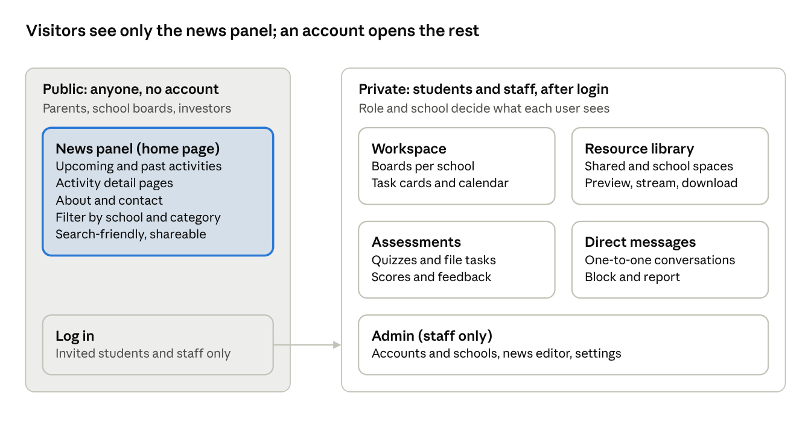
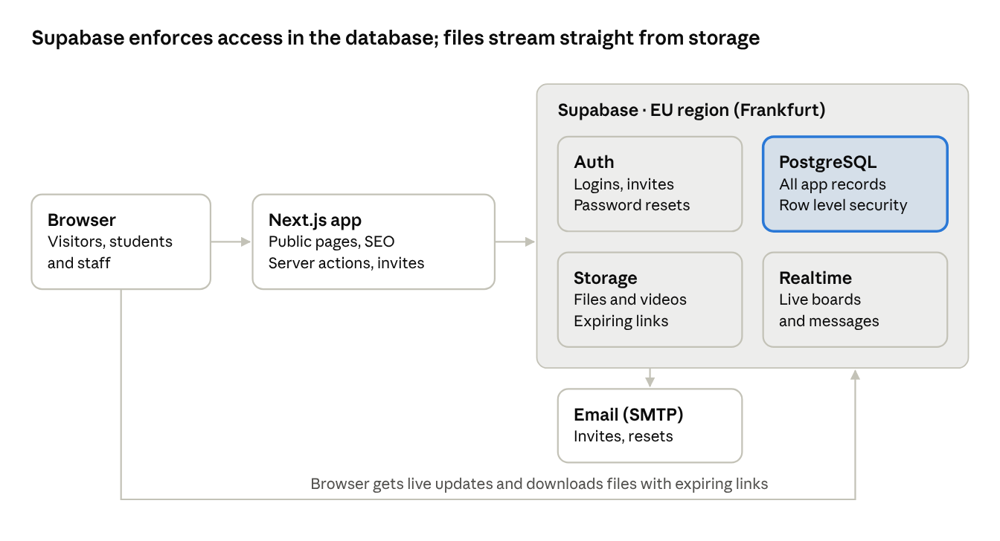
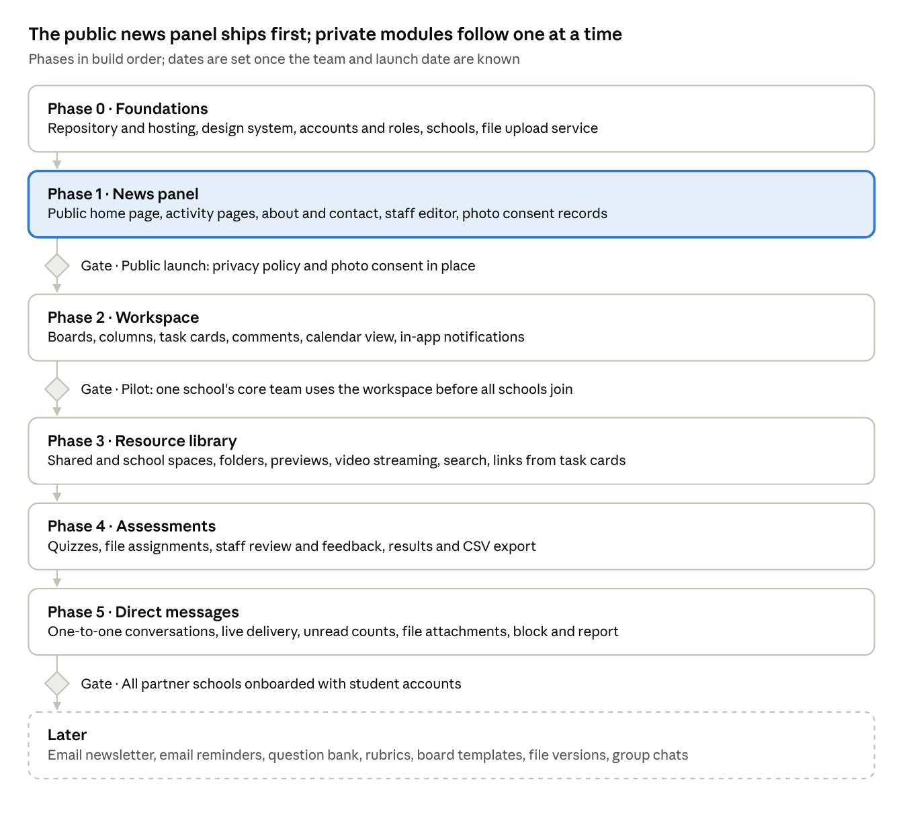

# Reform Academy Platform — Product Requirements Document

> Snapshot exported from the living PRD (Claude Doc, https://claude.ai/code/artifact/437ff47c-b36b-4759-ac9f-a785e41753a3) on 1 Oct 2026. Edit the living doc first, then re-export here.

Oct 1, 2026 · @pirjo · Status: Draft v0.1

## Overview

Reform Academy needs one website that shows the public what the academy does and gives students and staff a private space to plan projects, share resources and check what was learned.

Reform is a non-formal education academy that strengthens high school students' ability to communicate, plan and carry out projects. Each partner high school has a core team of students who run projects with Reform's support. Most learning happens in in-person meetings; the site supports the work between them and makes it visible to parents, school boards and investors.

### Goals

1. Show every stakeholder what is happening at the academy, with no account needed.
2. Give each high school's core team one place to describe, assign and schedule project tasks.
3. Keep learning resources (videos, PDFs, presentations) in one organized library.
4. Let staff check how well students understood each in-person meeting, through quizzes and file submissions.
5. Let students and staff talk to each other in private messages, without leaving the site.

### Non-goals for the first release

- Accounts for parents, school boards or investors
- Native mobile apps (the site is mobile-friendly instead)
- Video calls, payments or donations
- Formal grading or links to schools' own systems

### Success metrics

Targets are set with Reform after a first month of baseline data.

| Goal | Metric |
| --- | --- |
| Public visibility | Monthly visitors to the news panel; posts published per month |
| Workspace adoption | Share of core-team members active each week; tasks completed per school per month |
| Resource use | Files uploaded and opened per month |
| Learning check | Share of assigned students who complete each assessment; average score per meeting |

## Stakeholders and user roles

Five stakeholder groups use the site, but only students and Reform staff get accounts; everyone else reads the public news panel.

| Stakeholder | What they need from the site | Access |
| --- | --- | --- |
| Students (core team members) | Plan and track their school's projects, find resources, take assessments | Account |
| Reform organization staff | Publish news, oversee every school, manage resources, create and review assessments, manage accounts | Account |
| Parents | See what the academy does and which activities their children join | News panel only |
| School boards | See the academy's activities and impact in their school | News panel only |
| Investors | See the academy's activity, reach and results | News panel only |

### Roles in the system

- **Visitor** — anyone without an account; sees the news panel only.
- **Student** — belongs to one high school; uses that school's workspace, the resource library, their own assessments and direct messages.
- **Core lead** (proposed) — a student who can also create boards and manage members of their school's workspace.
- **Staff** — Reform organization member; sees every school, publishes news, manages resources, creates and reviews assessments.
- **Admin** — staff who also manage accounts, schools and site settings.

## Scope and information architecture

The site has one public area, the news panel, and a private area behind login with the workspace, resource library, assessments, direct messages and staff admin.

After login, each user's role and school decide which boards, files and assessments they see. Staff write news-panel posts in the admin area, and the five modules share one account system and one file store.

## Module 1 — News panel (public homepage)

The homepage is a public, newsletter-style panel of activities that already happened or are coming up, readable by anyone without logging in.

### User stories

- As a parent, I want to see upcoming academy events so I know what my child is involved in.
- As an investor, I want to browse past activities and their results so I can judge the academy's impact.
- As a school board member, I want to filter activities by my school.
- As a staff member, I want to publish an activity with photos in a few minutes.

### Requirements

| ID | Requirement | Priority |
| --- | --- | --- |
| NP-1 | Homepage lists upcoming activities first, then recent past ones, as cards: cover image, title, date, location, school, short summary | Must |
| NP-2 | Each activity has a detail page: full description, photo gallery, date and time, location, participating schools, links | Must |
| NP-3 | Visitors filter by upcoming or past, category (workshop, meeting, event, project showcase) and school, and search by keyword | Must |
| NP-4 | Staff create, edit, preview, publish and unpublish posts in a rich-text editor with image upload, including drafts and scheduled publishing | Must |
| NP-5 | Pages load without login, are indexed by search engines and show a preview when shared on social media | Must |
| NP-6 | An "academy at a glance" strip shows headline numbers (schools, students, projects, meetings) that staff keep up to date | Should |
| NP-7 | An About and contact page explains what Reform is, lists partner schools and says how to get involved | Should |
| NP-8 | Visitors can add an upcoming event to their calendar (.ics file) | Could |
| NP-9 | Visitors can subscribe to an email newsletter of new posts | Could |

Photos of students on this public page need consent from the student, or a parent where the law requires it (see Non-functional requirements).

## Module 2 — Workspace

Each high school's core team gets a private, Trello-style workspace of boards, columns and task cards to describe, assign and schedule project work.

### User stories

- As a core team member, I want to break a project into tasks and assign them so everyone knows who does what, by when.
- As a core lead, I want to see overdue tasks so I can follow up.
- As a staff member, I want to see each school's progress without having to ask.

### Requirements

| ID | Requirement | Priority |
| --- | --- | --- |
| WS-1 | Each high school has its own workspace; its core team and staff can open it, other schools cannot | Must |
| WS-2 | A workspace holds one or more boards (for example one per project); each board has columns, by default To do, In progress and Done, that the team can rename, add and reorder | Must |
| WS-3 | A card (task) has a title, description, assignees, due date, labels and a checklist | Must |
| WS-4 | Members drag cards between columns and reorder them | Must |
| WS-5 | Members comment on cards and attach files, either from the resource library or from their device | Must |
| WS-6 | A calendar view shows cards by due date across a school's boards | Should |
| WS-7 | In-app notifications when someone is assigned or mentioned, or a due date is 24 hours away | Should |
| WS-8 | Each card keeps a history of who created, moved or edited it, and when | Should |
| WS-9 | Changes made by one member appear for others without reloading the page | Should |
| WS-10 | Staff see an overview of open, overdue and completed tasks per school | Should |
| WS-11 | Email reminders before due dates | Could |
| WS-12 | Staff create board templates (for example "Event planning") that any school can copy | Could |

Gantt charts, time tracking and automation rules are out of scope for the first release.

## Module 3 — Resource library

Students and staff store and find learning resources (videos, PDFs, presentations, images) in one private library, organized by space and folder.

### User stories

- As a staff member, I want to upload the slides and recording of each in-person meeting so students can review them.
- As a student, I want to find last week's meeting material quickly, on my phone.
- As a core team member, I want to keep our project's files in one place.

### Requirements

| ID | Requirement | Priority |
| --- | --- | --- |
| RL-1 | Logged-in users upload common file types: video (MP4, MOV), PDF, Office documents, images and audio | Must |
| RL-2 | Files live in spaces and folders: a shared Reform library (staff upload, everyone reads) and one space per school (its core team and staff read and write) | Must |
| RL-3 | Files open in the browser: PDFs and images preview, videos stream, other files download | Must |
| RL-4 | Each file shows its name, description, type, size, uploader, upload date and tags | Must |
| RL-5 | Users search by name or tag and filter by type, space and date | Must |
| RL-6 | Uploads are checked for file type and size; the per-file limit and each school's storage quota are settings staff can change | Must |
| RL-7 | Only logged-in users with access to a space can reach its files, through download links that expire | Must |
| RL-8 | Deleted files go to a trash and can be restored for 30 days | Should |
| RL-9 | A file can be linked from news posts, task cards and assessments without uploading it again | Should |
| RL-10 | Uploading a new version of a file keeps the earlier versions | Could |

Video drives most of the storage and bandwidth cost. Long recordings could instead be hosted as unlisted videos on a video platform and linked from the library (see Open questions).

## Module 4 — Assessments

After each in-person meeting, staff publish a quiz or a file task so students can show what they understood and staff can see what to revisit.

There are two kinds of assessment:

- **Quiz** — questions scored automatically (single choice, multiple choice, true/false), plus open answers that staff review.
- **Assignment** — instructions and a deadline; the student hands in one or more files, a link or a short text.

### User stories

- As a student, I want to see which assessments are due and when, then get my score and feedback.
- As a staff member, I want to create a short quiz right after a meeting and send it to the schools that attended.
- As a staff member, I want to see which questions most students got wrong so the next meeting can revisit them.

### Requirements

| ID | Requirement | Priority |
| --- | --- | --- |
| AS-1 | Staff create quizzes with single-choice, multiple-choice, true/false and open-answer questions | Must |
| AS-2 | Staff create assignments with instructions, attached resources and a deadline; students hand in files, a link or text | Must |
| AS-3 | Each assessment is linked to an in-person meeting (an activity on the news panel) and assigned to one or more schools or to specific students | Must |
| AS-4 | Each assessment has open and close dates, a number of allowed attempts, an optional time limit, and a setting for when students see the correct answers | Must |
| AS-5 | Students see their assessments grouped as to do, submitted and reviewed, with due dates | Must |
| AS-6 | Choice questions are scored automatically; staff score open answers and files and add written feedback | Must |
| AS-7 | Students see only their own scores and feedback; other students and visitors never see them | Must |
| AS-8 | Staff see results per assessment, question, school and student, and export them as CSV | Should |
| AS-9 | Late hand-ins are accepted and marked late, unless staff turn this off | Should |
| AS-10 | Students are notified when an assessment opens, 24 hours before it closes, and when it has been reviewed | Should |
| AS-11 | Staff reuse questions from a question bank | Could |
| AS-12 | Staff score hand-ins against a rubric | Could |

Scores are feedback for students and staff, not formal grades.

## Module 5 — Direct messages

Everyone with an account gets a private messages section to talk one-to-one with other students and staff.

### User stories

- As a student, I want to message a teammate about a task without leaving the site.
- As a staff member, I want to answer a student's question about an assessment privately.
- As a student, I want to block someone and report a message that makes me uncomfortable.

### Requirements

| ID | Requirement | Priority |
| --- | --- | --- |
| DM-1 | Account holders start one-to-one conversations with other account holders they are allowed to message (see Open questions) | Must |
| DM-2 | A conversation list shows each conversation's latest message and unread count, newest first | Must |
| DM-3 | New messages appear within about a second without reloading, with an in-app notification | Must |
| DM-4 | Users find people to message by name, filtered by school and role | Must |
| DM-5 | Users can block another user and report a message; reports go to admins with the conversation attached | Must |
| DM-6 | Messages are private: staff and admins open a conversation only when it is reported, and every such access is logged | Must |
| DM-7 | Users attach images and PDFs, or link files from the resource library | Should |
| DM-8 | Users edit or delete their own messages | Should |
| DM-9 | An email alert goes out for messages unread after 12 hours; users can turn it off | Could |
| DM-10 | Group conversations, for example a whole core team | Could |
| DM-11 | Read receipts and typing indicators | Could |

Most users are minors, so Reform needs a written rule for staff–student messages and a retention period for messages before this module launches.

## Accounts, roles and permissions

Reform staff create every account (there is no public sign-up), and the server checks each request against the user's role and school, not just the menus they see.

### Account lifecycle

- Staff invite users by email, one at a time or by CSV import (name, email, school, role); the invitee sets a password from the link.
- Users log in with email and password and can reset a forgotten password by email. Google sign-in is optional (see Open questions).
- Staff and admin accounts use two-factor authentication.
- When a student graduates or leaves, an admin deactivates the account; their tasks and files stay with the school.
- A profile holds name, optional photo, school and graduation year.

### Permission matrix

| Action | Visitor | Student | Core lead | Staff | Admin |
| --- | --- | --- | --- | --- | --- |
| View the news panel | Yes | Yes | Yes | Yes | Yes |
| Publish news posts | No | No | No | Yes | Yes |
| View workspace boards | No | Own school | Own school | All schools | All schools |
| Create and edit task cards | No | Own school | Own school | All schools | All schools |
| Create boards, manage workspace members | No | No | Own school | All schools | All schools |
| Read the shared Reform library | No | Yes | Yes | Yes | Yes |
| Upload to the shared Reform library | No | No | No | Yes | Yes |
| Read and upload in a school space | No | Own school | Own school | All schools | All schools |
| Take assessments | No | Assigned ones | Assigned ones | No | No |
| Create and review assessments | No | No | No | Yes | Yes |
| See assessment results | No | Own | Own | All | All |
| Manage accounts, schools and settings | No | No | No | No | Yes |
| Send and receive direct messages | No | Yes | Yes | Yes | Yes |

## Non-functional requirements

Most account holders are minors, so privacy and access control come first; the site must also be fast on phones and cheap to run.

| Area | Requirement |
| --- | --- |
| Privacy | Comply with the data protection law where Reform operates (GDPR in the EU). Collect only the data each feature needs, publish a privacy policy, and let users export or delete their data. Get parental consent where the law requires it for younger students; confirm the age threshold with a legal adviser. |
| Photo consent | Student photos and names appear on the public news panel only with recorded consent, and staff can see that consent when they publish. |
| Security | HTTPS everywhere; passwords hashed with bcrypt or Argon2; role checks on every server request; uploads checked for type and size and scanned for malware; rate-limited login; protection against the OWASP Top 10 web risks. |
| Hosting | Data and files are stored in the EU. |
| Backups | Daily database backups kept for 30 days; replicated file storage; one full restore tested before launch. |
| Performance | The news panel's main content appears in under 2.5 seconds on a mid-range phone on 4G; workspace actions respond in under 300 ms. |
| Availability | 99.5% monthly uptime. |
| Devices | Every page works on screens from 360 px wide (phones) to desktop, in current Chrome, Safari, Firefox and Edge. |
| Accessibility | Meets WCAG 2.1 AA: keyboard navigation, sufficient colour contrast, alt text on images, captions on videos where possible. |
| Languages | The interface supports more than one language from day one; Romanian and English are assumed. |
| Audit | Admin actions (account, permission and deletion changes) are logged with who and when. |
| Running cost | Low fixed monthly cost, using managed services with free or low-cost tiers; budget to be confirmed. |

## Technical considerations

The stack was chosen on 1 Oct 2026: Next.js 16 with Supabase (PostgreSQL with row level security, Auth, Storage and Realtime), hosted in an EU region.

Next.js renders public pages on the server so search engines can read them, and runs the privileged server code such as invites and admin actions. Supabase enforces every permission rule inside the database, pushes live board updates and new messages through Realtime and hands out short-lived Storage links, so large files never pass through the web server.

### Stack options

| Option | Front end | Back end and data | Strength | Trade-off |
| --- | --- | --- | --- | --- |
| A. Next.js + Supabase (chosen) | Next.js (React, TypeScript) | Supabase: PostgreSQL, login, file storage, live updates, row-level access rules | Fastest to build | Less custom back-end code; some features tie you to Supabase |
| B. Next.js + own API | Next.js (React, TypeScript) | Node.js API (NestJS or Express), PostgreSQL with Prisma, S3-compatible storage | Full control and a clean front-end/back-end split | More to build and run: login, file access, live updates |
| C. Django | Django templates with some React | Django, PostgreSQL, built-in Django admin | Staff admin screens come almost free | Drag-and-drop boards still need a separate JavaScript front end |

The repository (reform\_Web) holds the Next.js app at its root and the database migrations and email templates in supabase/.

### Data model sketch

| Area | Main entities |
| --- | --- |
| People | School, User, Membership (user, school, role), Consent |
| News panel | Activity (title, dates, location, category, schools), Photo |
| Workspace | Board, Column, Card, Assignee, ChecklistItem, Comment, CardEvent |
| Resource library | Space, Folder, File, FileVersion, Tag |
| Assessments | Assessment, Question, Choice, Attempt, Answer, Submission, Feedback |
| Shared | Notification, AuditLogEntry |
| Direct messages | Conversation, Participant, Message, Block, Report |

## Release plan

The public news panel ships first, right after accounts and file upload work; each private module then follows in the order the site was described.

In phase 2, task cards take files uploaded from a device; linking files from the library arrives with phase 3. The "Could" requirements wait for the Later band unless time allows earlier.

## Open questions and assumptions

Fifteen questions need answers from Reform before design starts; tick each one off as it is settled.

### Open questions

- [ ] How many high schools and students will use the site at launch, and in two years?
- [ ] Which country or countries does Reform operate in? This decides the data protection rules.
- [ ] Which languages does the site need: Romanian, English, or both?
- [ ] Should parents ever get accounts, for example to follow their child's progress?
- [ ] Does each core team have a student lead who manages its workspace?
- [ ] Can students see other schools' boards and files, or only their own?
- [ ] What is the largest video the library must hold, and should long recordings live on a video platform instead?
- [ ] Should students see correct quiz answers right after submitting, or only after the quiz closes?
- [ ] How is photo consent collected today, and from whom?
- [ ] Does Reform have a logo, brand colours and a domain name?
- [ ] Do partner schools use Google Workspace or Microsoft 365, which would make Google or Microsoft sign-in useful?
- [ ] What is the monthly budget for hosting and storage?
- [ ] Who builds and maintains the site, and is there a target launch date?
- [ ] Who can message whom: anyone with an account, or only people in the same school plus staff?
- [ ] What safeguarding rule applies to staff–student messages, for example a second staff member being able to read them, and how long are messages kept?

### Assumptions in this draft

- Each high school has one core team, and each student belongs to one school.
- Staff create all accounts; there is no public sign-up.
- The in-person meetings that assessments refer to are activities on the news panel.
- Assessment scores are feedback, not formal grades.
